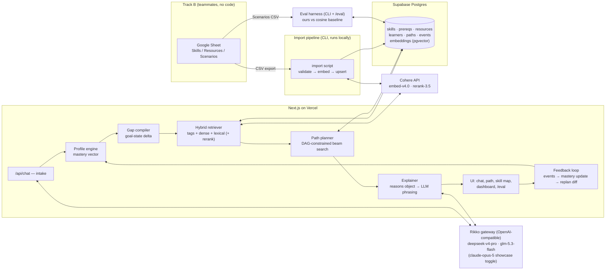

# 02 — ARCHITECTURE

Working name: **Waypoint** — an AI learning-path planner over a skill graph.

## 1. Stack (bias: one person, ship fast, zero-config deploys)

| Layer                 | Choice                                                                 | One-line justification                                                                                                                                                                                                                                                                                                                                                                                   |
| --------------------- | ---------------------------------------------------------------------- | -------------------------------------------------------------------------------------------------------------------------------------------------------------------------------------------------------------------------------------------------------------------------------------------------------------------------------------------------------------------------------------------------------- |
| App framework         | **Next.js 16 (App Router) + TypeScript**                               | Frontend + API routes in one repo, one deploy, one language; no separate backend to run.                                                                                                                                                                                                                                                                                                                 |
| Hosting               | **Vercel**                                                             | Git-push deploys, preview URLs, env var UI; deploy the stub on night one.                                                                                                                                                                                                                                                                                                                                |
| Database              | **Supabase Postgres + pgvector**                                       | Managed PG with pgvector preinstalled and a table UI for eyeballing imports; free tier suffices.                                                                                                                                                                                                                                                                                                         |
| ORM                   | **Drizzle**                                                            | Typed schema-in-code, trivial migrations, no codegen ceremony.                                                                                                                                                                                                                                                                                                                                           |
| LLM                   | **Rikko gateway (myrikko.ai, OpenAI-compatible) via `openai` npm SDK** | One key Devansh already has ($40 budget); model per role via env: `deepseek-v4-pro-0813` primary (chat/extraction/explanations, $0.462/$1.386 per MTok), `glm-5.3-flash` for bulk-cheap calls ($0.05/$0.15), `claude-opus-5` as optional showcase toggle for the final demo recording ($3.50/$17.50). JSON reliability = `response_format` json mode where supported + Zod parse + one retry-on-invalid. |
| Embeddings + reranker | **Cohere: `embed-v4.0` + `rerank-3.5` (free trial key)**               | Hosted embed + cross-encoder rerank, no model serving; trial tier covers a 300-item corpus trivially. **No hard dependency:** if unavailable, the hybrid scorer renormalizes to tag + lexical signals and the rerank flag stays off.                                                                                                                                                                     |
| UI                    | **React + Tailwind + shadcn/ui (via shadcn MCP)**                      | Registry blocks for all layout; hand-write only the novel pieces (path view, diff callout).                                                                                                                                                                                                                                                                                                              |
| Graph viz             | **@xyflow/react (React Flow)**                                         | The only credible 3-hour path-on-DAG visual. Stretch item.                                                                                                                                                                                                                                                                                                                                               |
| Charts                | **Recharts**                                                           | Dashboard sparklines/progress; dataviz skill governs styling.                                                                                                                                                                                                                                                                                                                                            |
| Validation            | **Zod**                                                                | One schema language for API inputs, LLM structured outputs, and CSV import.                                                                                                                                                                                                                                                                                                                              |
| Tests                 | **Vitest**                                                             | Fast, zero-config with TS; unit tests target the planner/scorer, not the UI.                                                                                                                                                                                                                                                                                                                             |

Explicitly rejected: separate FastAPI backend (second deploy + CORS + duplicated types, zero benefit at this scale); LangChain/LlamaIndex (abstraction tax, we make ~4 kinds of API call); self-hosted embedding models (Vercel serverless can't, and a second host is solo-dev poison); Neo4j for the DAG (~60 skills fit in two PG tables and application memory — a graph DB is résumé-driven at this size).

Budget note ($40 on the Rikko gateway): worst-case dev + eval + demo traffic ≈ 3M input / 1M output tokens on the primary (~$2.80) + pennies on flash + one showcase recording run (~$3) — total well under $10, giving 4× headroom. Base URL and all three model IDs are env vars (`LLM_BASE_URL`, `LLM_MODEL_PRIMARY`, `LLM_MODEL_FAST`, `LLM_MODEL_SHOWCASE`), so swapping models is a config change, not a code change.

## 2. System diagram



## 3. Data model

### 3.1 Postgres schema (Drizzle)

```
skills           id (slug PK), name, domain, description
skill_prereqs    skill_id → prereq_id            -- DAG edges over SKILLS, not courses
resources        id (RES-### PK), title, url, provider,
                 type enum(course|video|article|project|assessment),
                 description, difficulty int 1..5, est_hours numeric,
                 quality int 1..5, embedding vector(1536), tsv tsvector
resource_skills  resource_id, skill_id, relation enum(teaches|requires), level int 1..5
learners         id, name, goal_text, constraints jsonb(hours_per_week, deadline, formats)
learner_skills   learner_id, skill_id, mastery real 0..1,
                 source enum(stated|completed_course|quiz|feedback|inferred), updated_at
paths            id, learner_id, goal_skills jsonb, created_at, superseded_by
path_items       path_id, position, resource_id,
                 status enum(pending|in_progress|done|struggled|skipped),
                 reasons jsonb, milestone_label text nullable
events           id, learner_id, type, payload jsonb, ts   -- append-only feedback log
eval_scenarios   id, persona jsonb, goal text, expert_path jsonb, rationale text
```

Paths are immutable; replanning writes a new row with `superseded_by` back-links — that gives the adaptation **diff view** for free and an audit trail for the doc.

### 3.2 The corpus: where it comes from

Three sources, layered:

1. **Bootstrap (me, night one):** ~30 skills and ~20 hand-tagged resources for one domain, committed as CSV in `data/bootstrap/`. Nothing ever blocks on Track B.
2. **Curated corpus (Track B, the real asset):** 150–300 resources across **2–3 domains max** (proposal: _web development_, _data science/ML_, + one more if pace allows — depth beats breadth; a judge probes one domain deeply, not ten shallowly). Sourced from public catalogs (Coursera/edX/freeCodeCamp/YouTube/docs), **described in their own words** and tagged against our skill list.
3. **Optional bulk filler:** Kaggle Coursera/edX dumps imported untagged for search-breadth demos only. Never enters path planning (no skill tags → not eligible). Cut without cost.

### 3.3 Spreadsheet schema — THE handoff boundary (teammates fill, I import)

One Google Sheet, three tabs, exact column names. The import script is the contract enforcer: it fails loudly with row numbers, so the sheet must be right, not pretty.

**Tab `Skills`** — build this first; Resources reference it.

| Column         | Rule                                                              | Example                                    |
| -------------- | ----------------------------------------------------------------- | ------------------------------------------ |
| `slug`         | kebab-case, unique, stable                                        | `sql-joins`                                |
| `name`         | display name                                                      | `SQL Joins`                                |
| `domain`       | one of the agreed domain slugs                                    | `data-science`                             |
| `prereq_slugs` | comma-separated slugs **from this tab**; empty allowed; no cycles | `sql-basics`                               |
| `description`  | one sentence                                                      | `Combining tables with inner/outer joins.` |

**Tab `Resources`**

| Column            | Rule                                                          | Example                     |
| ----------------- | ------------------------------------------------------------- | --------------------------- |
| `id`              | `RES-` + 3 digits, unique                                     | `RES-041`                   |
| `title`           | as published                                                  | `SQL for Data Analysis`     |
| `url`             | real, deduplicated                                            | `https://…`                 |
| `provider`        | free text                                                     | `Coursera`                  |
| `type`            | `course` \| `video` \| `article` \| `project` \| `assessment` | `course`                    |
| `description`     | 2–4 sentences, **own words**, say what it actually teaches    | —                           |
| `difficulty`      | 1–5 (1 = true beginner)                                       | `2`                         |
| `est_hours`       | number, honest                                                | `12`                        |
| `skills_taught`   | comma-separated `slug:level` pairs, level 1–5                 | `sql-joins:3, sql-basics:4` |
| `skills_required` | comma-separated `slug:level`; empty = none                    | `sql-basics:2`              |
| `quality`         | 1–5 your judgement                                            | `4`                         |
| `notes`           | anything for me                                               | —                           |

**Tab `Scenarios`** — ground truth for the eval harness (D3).

| Column           | Rule                                                                                                    | Example                                        |
| ---------------- | ------------------------------------------------------------------------------------------------------- | ---------------------------------------------- |
| `scenario_id`    | `SCN-` + 2 digits                                                                                       | `SCN-03`                                       |
| `persona_name`   | memorable                                                                                               | `Riya, commerce grad`                          |
| `background`     | 3–5 sentences of realistic context                                                                      | —                                              |
| `stated_skills`  | comma-separated `slug:level` the persona already has                                                    | `python-basics:3`                              |
| `goal`           | one sentence, natural language                                                                          | `Become a data analyst employable in 6 months` |
| `expert_path`    | **ordered** comma-separated `RES-` ids — the path a human expert would prescribe from our Resources tab | `RES-002, RES-041, RES-013`                    |
| `rationale`      | why this order — 2–3 sentences                                                                          | —                                              |
| `hours_per_week` | number                                                                                                  | `8`                                            |

Import path: File → Download → CSV per tab → `npm run import -- data/skills.csv data/resources.csv data/scenarios.csv`. The script: (1) validates — unknown slugs, level ranges, duplicate URLs/ids, **prereq cycles (topological check)**, expert paths referencing missing resources; (2) prints an error report with row numbers, or (3) embeds resource cards via Cohere in one batch and upserts. Re-runnable/idempotent; v1 and v2 corpus drops are just two runs.

## 4. AI/ML layer (the 20% — design, not summary)

### 4.1 What a learner query is matched against — and why

**Position: retrieval matches the gap (goal-state delta), never the raw query text.**

The naive design embeds the learner's sentence ("I want to be a data analyst") and cosine-matches course descriptions. Three structural failures: (a) the query describes a _destination_, so it retrieves destination-shaped content — advanced courses the learner can't take yet; (b) it can't see what the learner already knows, so it retrieves redundantly; (c) similarity is order-blind, and this problem is _about_ order.

Ours:

- **Learner state `S`**: mastery vector over the skill graph, `m_s ∈ [0,1]` per skill, assembled from stated skills, completed courses (a completed course confers its `teaches` levels, discounted), quiz results, and feedback events.
- **Goal state `G`**: the intake extractor (primary LLM, JSON-mode structured extraction, **enum-constrained to our canonical skill slugs** and Zod-validated — it cannot invent skills) compiles the goal sentence to target skills with levels.
- **Gap `Δ = closure(G) − S`**: goal skills below target _plus every unmastered ancestor_ under the prerequisite DAG. The gap, not the goal, is the retrieval target — this is where "identify skill gaps" from the brief becomes an actual object in the system, inspectable in the UI.

Retrieval then runs **per frontier skill** (gap skills whose prerequisites are already mastered/scheduled), scoring resources by hybrid signal (4.2). The dense query is a synthesized **gap card** — a short structured text ("needs: joins at working level; knows: basic SQL; goal context: analyst role; prefers: video, ≤5 h/wk") — embedded with Cohere. We match need-shaped queries against teach-shaped items.

### 4.2 Hybrid retrieval, designed for this corpus shape

Corpus shape: ~300 **short, structured** items with skill-tag metadata — not long documents. Consequences we commit to: exact scan beats ANN (no index tuning; pgvector exact at n=300 is microseconds); **metadata is the primary signal and text is the tiebreaker** — the inverse of document search.

Per candidate resource `r` for gap `Δ`:

```
score(r, Δ) = 0.5 · tag_score(r, Δ)        -- weighted overlap: Σ over taught skills of
                                            --   Δ-weight × min(taught_level, needed) / needed,
                                            --   normalized; penalize teaching already-mastered skills
            + 0.3 · dense(gap_card, r)      -- Cohere embed-v4.0 cosine
            + 0.2 · lexical(goal_terms, r)  -- Postgres tsvector rank
            × quality_prior(r)              -- 0.8 + 0.04 · quality(1..5)
```

Weights start at 0.5/0.3/0.2 and are **tuned against the eval scenarios** (4.5) — the doc reports the sweep, which itself demonstrates real ML process. An optional final stage reranks the top-15 with Cohere `rerank-3.5` (hosted cross-encoder; query = gap card, documents = resource cards). It's a flagged stage (`RERANK=on|off`) so the eval harness reports its lift and the cut ladder can drop it without surgery.

Infrastructure is entirely standard — pgvector, tsvector, hosted embedding/rerank APIs. Nothing hand-rolled: no BM25 implementation, no index structures. The domain-specific part is the _scoring function and what gets embedded_, which is exactly where it should be.

### 4.3 How the DAG constrains generation (not a post-filter)

The planner is a beam search (width 3) over path prefixes:

- **Feasible set**: at each step, only resources with `requires ⊆ mastered(S) ∪ taught(prefix)` are candidates. The DAG gates **candidate generation** — infeasible items are never scored, never surface, never need filtering out. As items are scheduled, the frontier _expands_: scheduling "SQL Basics" is what makes "SQL Joins" resources eligible.
- **Step utility**:

```
U(r | prefix) = gap_closure(r, Δ_remaining) / est_hours(r)   -- marginal skills gained per hour
              × difficulty_fit(r, S′)                        -- ~1 inside the learner's zone
                                                             -- (difficulty ≤ current level + 1),
                                                             -- decaying penalty outside it
              − λ · redundancy(r, prefix)                    -- overlap with already-scheduled teaches
```

- **Termination**: all goal skills reach target level, or the learner's hour budget (from constraints) is exhausted — in which case the path is explicitly labelled a "Phase 1" toward the goal.
- **Milestones**: emitted whenever a goal-subskill (a `G` member or a named DAG ancestor) reaches target — "Milestone: SQL proficiency" — satisfying required feature 4 with generated, not decorative, milestones.
- Post-filtering, by contrast (retrieve by similarity → drop violations), collapses exactly when the learner is far from the goal — every top-k item is infeasible and you're left reordering garbage. We put this argument, with an example from the eval set, in the solution doc.

### 4.4 Skill-gap representation over time → ranking that changes

Mastery updates are rule-based, legible, and logged as events:

- `completed(r)` → for each taught skill: `m ← max(m, level/5 × (0.7 + 0.06·quality))`
- `struggled(r)` → for each _required_ skill of `r`: `m ← m × 0.6`, and the planner inserts a remedial step targeting the weakest required skill.
- `quiz(skill, correct?)` → `m ± 0.15`, clamped (stretch S2).
- **Propagation (stretch)**: mastery of skill `s` implies floor `0.5 × m_s` on each prerequisite of `s` — evidence flows down the DAG.

Every event triggers a replan from the updated `S`; the new path row links its predecessor, and the UI diffs them: _"Because you struggled with SQL Joins, we inserted Relational Algebra Basics and pushed Query Optimization back."_ Ranking demonstrably changes as the learner progresses — required feature 6's "next recommended actions" is just the head of the current path.

### 4.5 What the ranking objective optimizes — and how we show judges it wins

**Objective:** _maximize expected mastery gain toward the goal per hour of learner effort, subject to prerequisite feasibility and difficulty within the learner's zone._ Naive semantic similarity optimizes _topical resemblance to the query_ — order-blind, redundancy-blind, feasibility-blind.

Evidence, not assertion — the **eval harness** (`npm run eval`, plus `/eval` page):

- Input: the hand-labelled Scenarios tab (Track B).
- For each scenario, run (A) cosine-similarity top-k baseline, sequenced by similarity — the wrapper build, implemented honestly — and (B) full pipeline; (C) = B with rerank, when enabled.
- Metrics per system, macro-averaged:
  - **Prereq violation rate** — % of path steps whose required skills aren't covered by prior steps + persona's stated skills. Headline metric; ours is 0 by construction and the demo says so.
  - **Gap coverage** — % of `Δ` reaching target level by path end.
  - **Redundancy** — share of taught-skill mass already mastered/covered earlier.
  - **Expert agreement** — nDCG of expert's resources in our path + Kendall-τ on the common-item ordering.
  - **Hours to goal** vs. expert's total.
- Output: JSON + markdown table (committed, quoted in the doc, rendered at `/eval`).

The weight sweep in 4.2 runs against these same scenarios: choosing 0.5/0.3/0.2 becomes a reported experiment. That plus a baseline comparison is more _actual ML methodology_ than any amount of model name-dropping.

### 4.6 Explanations and conversation

- **Explanations (D5):** planner emits a `reasons` object per item — gap skills covered (with levels), unlocked-by links, difficulty fit, hours, milestone contribution. One primary-LLM call with JSON-mode output phrases it in second person. System prompt forbids content beyond the object; a deterministic template renders if the API errors. **The LLM cannot hallucinate a recommendation because it doesn't make recommendations.**
- **Intake chat (feature 1):** streaming chat; each turn, a structured-output extraction updates `{stated_skills, goal_skills, constraints, preferences}` against enum'd slugs; the UI shows the profile panel filling live (feature 2's demo moment). When goal + at least one stated skill exist, the assistant offers to generate.
- **Learner queries (feature 5):** same chat, grounded: context = current path + reasons objects + profile. Questions like "why is this before that?" are answered from the DAG edge, quoted in the reply.

## 5. API surface

All route handlers, Zod-validated, JSON errors `{error, detail}`:

```
POST /api/chat                      { learnerId?, messages[] } → SSE stream + profile-delta frame
POST /api/learners                  { name } → learner
GET  /api/learners/:id              → profile + mastery vector + active path summary
POST /api/paths                     { learnerId } → generated path (items + reasons + milestones)
GET  /api/paths/:id                 → path w/ items, statuses, predecessor diff if any
POST /api/paths/:id/feedback        { itemId, event: done|struggled|skipped } → new path + diff
POST /api/quiz/:learnerId           (stretch) → questions; POST answers → mastery updates
GET  /api/eval                      → latest eval run results
GET  /api/resources/search?q=       debug/admin — raw hybrid retrieval, used in dev verification
```

Import and eval are CLI scripts (`scripts/import.ts`, `scripts/eval.ts`) — not HTTP; they run locally against the same DB.

## 6. Frontend approach and visual direction

Mechanics: shadcn/ui via the **shadcn MCP server** — pull registry components/blocks (sidebar-dashboard block, chat patterns, cards, forms); never hand-write what the registry has, never guess props (fetch live examples). Hand-built only: path timeline, skill-map (React Flow), diff callout, eval table. **frontend-design skill runs before any UI is built**; the direction below is the commitment it will execute against.

**Direction: "Expedition map"** — the product is literally a route to a destination; the UI leans in, and no default-Tailwind wrapper looks like this.

- **Type:** Bricolage Grotesque (display) + Inter at defined scale (12/14/16/20/28/40) — display face carries the identity, body stays invisible.
- **Color:** near-black ink canvas (`#0E1116` family), warm off-white text, **one accent — amber/gold** for the route line, waypoints, milestones, primary actions. Semantic green/red only for mastery deltas. Nothing else gets color; charts follow the dataviz skill's palette rules.
- **Spacing:** 4px base, 8/12/16/24/40 rhythm, generous card padding; density only in the eval table.
- **Distinctive element:** the **route line** — an amber path connecting step cards (and tracing across the skill map), milestone waypoints as diamond markers, locked steps rendered as dashed "unexplored" segments that solidify as prerequisites clear. Appears on the path view, echoed as a micro-motif in the dashboard progress strip.
- Budget: UX is 10%; polish is time-boxed in 03-PLAN and cut before anything in the ML layer. Lighthouse accessibility ≥ 90 enforced by the verify-feature gate (contrast on amber/ink checked from the start, not retrofitted).

## 7. Deployment

- **Vercel**: repo pushed night one, stub deployed night one (first-deploy risk retired early); env vars `RIKKO_API_KEY`, `LLM_BASE_URL`, `LLM_MODEL_PRIMARY`, `LLM_MODEL_FAST`, `LLM_MODEL_SHOWCASE`, `COHERE_API_KEY`, `DATABASE_URL` in project settings; every push = deploy; the submitted URL is the production deployment.
- **Supabase**: one project; Drizzle migrations from local (`npm run db:push`); table editor for visual sanity checks after imports.
- **Repo**: GitHub (public or evaluator-shared) — deliverable #2. Conventional commits throughout (deliverable requirement: history reflects process).
- **ZIP script** (`npm run package`): builds the deliverable ZIP from `git archive` (respects .gitignore → node_modules/.next/env excluded by construction) + README check. Run on freeze day, not at 23:30.
